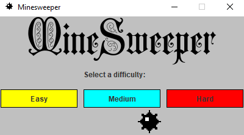
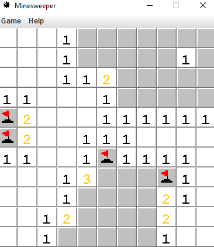

# Minesweeper
Bundled with Windows 3.1 in 1992, this classic game has been a staple for people who want a fun and interesting challenge while they kill time. This version was developed in Java by Brett Dispoto, Patrick Silvestre, and Jordan Conragan as a group project for their CS 151 class at San Jose State University during the Spring 2019 semester. 

## How To Run

To run the game ``git clone``, then click on Minesweeper.jar in the top level folder, ``Minesweeper``

## How to play
This version of Minesweeper is similar to the one Microsoft developed with a few small differences. The following is a list of the rules and other features in this available. 

* Flagging:  Right click on an unrevealed square in order to flag it. Right click again on a flagged tile to unflag it. You cannot reveal a flagged tile. Flagging a square signifies that you believe that there is a mine under that square. You are given an unlimited number of flags to use or not use. 
	
* Revealing:  Left click on an unrevealed square in order to reveal it. You cannot reveal a flagged square.	If you try to reveal a square that contains a mine, the game is over. A revealed square is a lighter color than an unrevealed square. A revealed square will display a number that shows how many mines are vertically, horizontally,or diagonally adjacent to that square. If there are no adjacent mines, then the surrounding squares will be revealed until there is an adjacent mine.
	
* Winning and Losing:  If you reveal a mine, it will blow up and display a game over screen. Congratulations, you just got yourself killed. If you reveal every square on the board that isn't a mine, then you win and will be presented with a victory screen.Congratulations, your prize is living.
	
* Difficulty:  There are three difficulties, each with a different number of squares and mines. 
	* Easy: 9x9 board with 8 mines
	* Medium: 11x11 board with 14 mines
	* Hard: 14x14 board with 34 mines
	
* Changing Difficulty:  Under the Game Menu, there is a Difficulty Menu. The difficulty selected indicates which difficulty will be used upon starting a new game, not necessarily the difficulty of the current game.

* Restarting:  To restart the game, click on Start New Game in the Game Menu. A new game will be immediately started using the difficulty selected in the Difficulty Menu. 

## Screenshots

