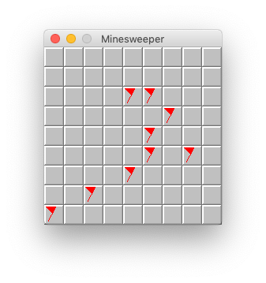
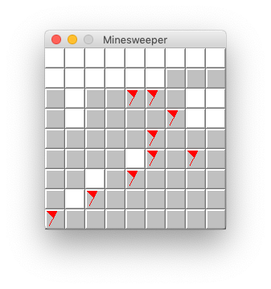
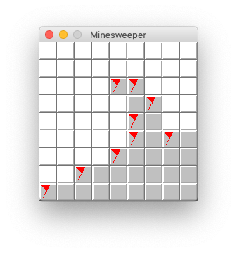

# Problem description
Upon a left click on a tile, `View` appears to be updated incorrectly, in that it does not fully reveal tiles that should be revealed. However, upon another left click, tiles that should have been revealed are revealed properly. This other left click can be on the board itself, or outside of the entire JFrame (inside the OS). This appears to be a purely visual bug related to MacOS, as `model.getBoard().getNumberTilesRevealed` seems to report the correct number of tiles that should be revealed.

# Replication steps
1. Left click a tile not adjacent to a mine

# Visual Output / Console Output
## Start
```
Flagging tile at: (2, 4)
Flagging tile at: (2, 5)
Flagging tile at: (3, 6)
Flagging tile at: (4, 5)
Flagging tile at: (5, 5)
Flagging tile at: (5, 7)
Flagging tile at: (6, 4)
Flagging tile at: (7, 2)
Flagging tile at: (8, 0)
Number of tiles revealed: 0
```


## Left click at (0, 0)
```
Click Detected: You've clicked the mine at(0, 0)
Revealing tile at: (0, 0)
Revealing tile at: (0, 1)
Revealing tile at: (0, 2)
Revealing tile at: (0, 3)
Revealing tile at: (0, 4)
Revealing tile at: (0, 5)
Revealing tile at: (0, 6)
Revealing tile at: (0, 7)
Revealing tile at: (0, 8)
Revealing tile at: (1, 0)
Revealing tile at: (1, 1)
Revealing tile at: (1, 2)
Revealing tile at: (1, 3)
Revealing tile at: (1, 4)
Revealing tile at: (1, 5)
Revealing tile at: (1, 6)
Revealing tile at: (1, 7)
Revealing tile at: (1, 8)
Revealing tile at: (2, 0)
Revealing tile at: (2, 1)
Revealing tile at: (2, 2)
Revealing tile at: (2, 3)
Flagging tile at: (2, 4)
Flagging tile at: (2, 5)
Revealing tile at: (2, 6)
Revealing tile at: (2, 7)
Revealing tile at: (2, 8)
Revealing tile at: (3, 0)
Revealing tile at: (3, 1)
Revealing tile at: (3, 2)
Revealing tile at: (3, 3)
Revealing tile at: (3, 4)
Flagging tile at: (3, 6)
Revealing tile at: (3, 7)
Revealing tile at: (3, 8)
Revealing tile at: (4, 0)
Revealing tile at: (4, 1)
Revealing tile at: (4, 2)
Revealing tile at: (4, 3)
Revealing tile at: (4, 4)
Flagging tile at: (4, 5)
Revealing tile at: (4, 7)
Revealing tile at: (4, 8)
Revealing tile at: (5, 0)
Revealing tile at: (5, 1)
Revealing tile at: (5, 2)
Revealing tile at: (5, 3)
Revealing tile at: (5, 4)
Flagging tile at: (5, 5)
Flagging tile at: (5, 7)
Revealing tile at: (6, 0)
Revealing tile at: (6, 1)
Revealing tile at: (6, 2)
Revealing tile at: (6, 3)
Flagging tile at: (6, 4)
Revealing tile at: (7, 0)
Revealing tile at: (7, 1)
Flagging tile at: (7, 2)
Flagging tile at: (8, 0)
Number of tiles revealed: 50
```


## Additional left click outside JFrame
